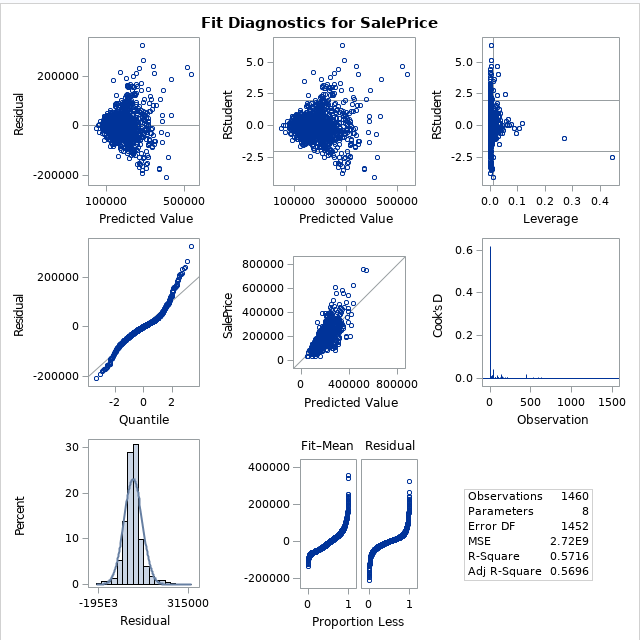

```{r setup, include=FALSE, echo=FALSE}
library(knitr)
knitr::opts_chunk$set(fig.path = 'images/', echo = FALSE)
```

\pagebreak

## Introduction

This is the final project for the semester in MSDS 6371 Statistical Foundation for Data Science, and is a group project.  It is based on the [Kaggle House Prices competition](https://www.kaggle.com/c/house-prices-advanced-regression-techniques).  Fundamentally we are seeking to answer what will the sale price of a house be based on some combination of predictive attribute measures of it.  The 2 specific questions below prescribe distinct approaches to answering this question.

## Data Description

As mentioned above, the data comes from the [Kaggle House Prices competition](https://www.kaggle.com/c/house-prices-advanced-regression-techniques).  The specific data sets we use for this project are the training data set (train.csv) to build the models, and test data set (test.csv) to cross-validate our models.

### train.csv

This dataset is roughly 450k with 1460 observations of 81 variables.  To read and understand more about this specific dataset please refer to the Kaggle website at [https://www.kaggle.com/c/house-prices-advanced-regression-techniques/data](https://www.kaggle.com/c/house-prices-advanced-regression-techniques/data).

### test.csv

This dataset, is roughly 441k with 1459 observation of 80 variables.  This has one less observation: SalesPrices.  This is due to the fact it is meant to be used for cross-validation, and does not require this variable because we are meant to predict that with our models.

### Primary Variables

The following variables are fundamental to the answer for Question 1, do not contain missing values, and require no cleaning:
* SalePrice - the property's sale price in dollars
* GrLivArea - Above grade (ground) living area square feet
* Neighborhood - Physical locations within Ames city limits

## Question 1

### The Problem

Ames Century 21 real estate would like us to perform the following analysis of homes:

For the neighborhoods of: BrkSide, Edwards and NAmes, please find a predictive model for home SalePrice based on GrLivArea.  Provide the model assumptions assessment with evidence, as well as data review and outlier analysis.  Please provide estimate or estimates with confidence intervals, and a written conclusion of the relationship of GrLivArea and SalePrice within these neighborhoods.

### Build and Fit the Model

#### Untransformed Data

```
SalePrice = beta0 + beta1*GrLivArea + beta2*d1 + beta3*d2 + beta4*d3 + beta5*int1 + beta6*int2 + beta7*int3
```

When looking at plots of the raw data, there is a clear linear relationship between GrLivArea and SalePrice on Image 001.  However, on Image 002 we can see several issues with the data:
* unequal spread on Residual vs Predicted and Studentized Residual vs Predicted, looks like the variance is increasing
* the qqplot is curved and the histogram is rather large in the middle suggesting non-normal data
* Cooks-D and Leverage show points that may have leverage and should be investigated

When looking at Image 003, most of the parameter estimates look good except for d3, int2 and int3.  The VIF for all estimates are high, the smallest being 22.  This is another sign that outliers should be investigated.

We need to perform outlier analysis and peform transformations to address equal deviation and normality.

#### Other Transformations

Log-Linear, and Linear_log were both experimented with.  None of the violations were addressed using any of these methods.  In some cases, it made the linear relationship worse with SalePrice.  For brevity, no graphs are provided for these transformations.

#### Log-Log Transformed Data

```
SalePrice = beta0 + beta1 * LogGrLivArea + beta3*d2 + beta4*d3 + beta6*centLint2 + beta7*centLint3
```

For brevity, some of the interative process for analyzing the data is omitted, but summarised here.  It was found that there was no statistical difference between the BrkSide and Edwards neighborhoods, so these were combined into a single entity.  Also, to address the high VIF values, the interaction variables were centered.

### Assumptions
When looking at the Log-Log transformed data in Image 004, the linear relationship looks much better.  Also,, when looking at the fit diagnostics in Image 005, we can se that the assumptions are addressed:
1.There is a clear linear trend with explanatory variables with the LogSalePrice
1. The histogram looks better and the QQ plot as well, combined with the large number of observations, we can say the data ius normal
1. All residual plots look like a good random cloud with equal variace across the graph
1. For independence, we do not know how the data were collected, and will assume that they are independent

The fit diagnostics in Image 005 and Regression statistics in Image 006 display that all issues are addressed with the data.

#### Outlier Analysis

After analyzing the scatterplots, we noticed the two observations that were from homes over 4500 square feet.  Since these two observations have high leverage, we decided to try to find other effects these observations might have. Looking at the group ranking of these observations we decided to remove these observations due to the effect these had on our model assumptions.  We were more interested in the observations that were centered around the middle of the ranking.

Additionally, the GrLivArea of these observations for the Edwards Neighborhood is thought to be not representative of this area.  These values were extremely above the third quartile.  Give this we justified removing these observations.

### Comparison of Competing Models

| Models        | Adusted R^2 | CV Press    |
|---------------|-------------|-------------|
| Untransformed | 0.5696      | 4.00198 E12 |
| Log-Log       | 0.5808      | 97.939      |

Image 007 and Image 008 capture the SAS output for the Untransformned and Log-Log transformed models respectively.

#### Models
1. `SalePrice    = 19972  +  87.163*GrLivArea   +  68382*d1  + 54705*d2  +  -12416*d3  +  -57.412*int1  +  -32.847*int2  +  31.351*int3`
1. `LogSalePrice = 5.844  +  0.845*LogGrLivArea +  0.094*d2  + 0.219*d3  +  -0.268*centLint2  +  0.169*centLint3`

### Parameters
* Estimates - refer to model #2 above for the parameter estimates
* Interpretation
* Confidence Intervals - refer to Image 007 for 95% confidence interval for the individual parameters.

### Conclusion


## Question 2

### The Problem

### Model Selection

#### Forward

##### Assumptions
* Linear Trend (Plots: Response vs Explanatory, Explanatory vs Explanatory)
* Normality (Residual: Scatter, QQ Plot, Histogram)
* Equal Standard Deviation (Residual Scatter Plots)

#### Backward

##### Assumptions
* Linear Trend (Plots: Response vs Explanatory, Explanatory vs Explanatory)
* Normality (Residual: Scatter, QQ Plot, Histogram)
* Equal Standard Deviation (Residual Scatter Plots)

#### Stepwise

##### Assumptions
* Linear Trend (Plots: Response vs Explanatory, Explanatory vs Explanatory)
* Normality (Residual: Scatter, QQ Plot, Histogram)
* Equal Standard Deviation (Residual Scatter Plots)

#### Custom

##### Assumptions
* Linear Trend (Plots: Response vs Explanatory, Explanatory vs Explanatory)
* Normality (Residual: Scatter, QQ Plot, Histogram)
* Equal Standard Deviation (Residual Scatter Plots)

### Comparison of Models
| Predictive Models | Adusted R^2 | CV Press | Kaggle Score |
|-------------------|:-----------:|:--------:|:------------:|
| Forward           | 0.1111      | 1111     | .111         |
| Backward          | 0.2222      | 2222     | .222         |
| Stepwise          | 0.3333      | 3333     | .333         |
| Custom            | 0.4444      | 4444     | .444         |

### Conclusion

## Appendix

## Question 1 SAS Code

```
/* Data Sets: 
   - Train0 - Kaggle Training Data Set 
   - TrainRed - Kaggle Training Data Set Reduced for question 1  
*/ 
filename CSV URL "https://dl.dropboxusercontent.com/spa/afq05cp80hp4ezn/downloads/public/msds-data/train.csv";

data TRAIN0;
%let _EFIERR_ = 0; /* set the ERROR detection macro variable */
infile CSV
delimiter = ',' MISSOVER DSD lrecl=32767 firstobs=2 ;
/* note regex used : \d\d\d[ ]* */
  informat Id 4. ;
  informat MSSubClass $3. ;
  informat MSZoning $7. ;  /* #31 c (all) */
  informat LotFrontage best32. ;
  informat LotArea best32. ;
  informat Street $4. ;
  informat Alley $4. ;
  informat LotShape $3. ;
  informat LandContour $3. ;
  informat Utilities $6. ;
  informat LotConfig $7. ;
  informat LandSlope $3. ;
  informat Neighborhood $7. ;
  informat Condition1 $6. ;
  informat Condition2 $6. ;
  informat BldgType $6. ;
  informat HouseStyle $6. ;
  informat OverallQual best32. ;
  informat OverallCond best32. ;
  informat YearBuilt best32. ;
  informat YearRemodAdd best32. ;
  informat RoofStyle $7. ;
  informat RoofMatl $7. ;
  informat Exterior1st $7. ;
  informat Exterior2nd $7. ;
  informat MasVnrType $7. ;
  informat MasVnrArea best32. ;
  informat ExterQual $2. ;
  informat ExterCond $2. ;
  informat Foundation $6. ;
  informat BsmtQual $2. ;
  informat BsmtCond $2. ;
  informat BsmtExposure $2. ;
  informat BsmtFinType1 $3. ;
  informat BsmtFinSF1 best32. ;
  informat BsmtFinType2 $3. ;
  informat BsmtFinSF2 best32. ;
  informat BsmtUnfSF best32. ;
  informat TotalBsmtSF best32. ;
  informat Heating $5. ;
  informat HeatingQC $2. ;
  informat CentralAir $1. ;
  informat Electrical $5. ;
  informat _1stFlrSF best32. ;
  informat _2ndFlrSF best32. ;
  informat LowQualFinSF best32. ;
  informat GrLivArea best32. ;
  informat BsmtFullBath best32. ;
  informat BsmtHalfBath best32. ;
  informat FullBath best32. ;
  informat HalfBath best32. ;
  informat BedroomAbvGr best32. ;
  informat KitchenAbvGr best32. ;
  informat KitchenQual $2. ;
  informat TotRmsAbvGrd best32. ;
  informat Functional $4. ;
  informat Fireplaces best32. ;
  informat FireplaceQu $2. ;
  informat GarageType $7. ;
  informat GarageYrBlt best32. ;
  informat GarageFinish $3. ;
  informat GarageCars best32. ;
  informat GarageArea best32. ;
  informat GarageQual $2. ;
  informat GarageCond $2. ;
  informat PavedDrive $1. ;
  informat WoodDeckSF best32. ;
  informat OpenPorchSF best32. ;
  informat EnclosedPorch best32. ;
  informat _3SsnPorch best32. ;
  informat ScreenPorch best32. ;
  informat PoolArea best32. ;
  informat PoolQC $2. ;
  informat Fence $5. ;
  informat MiscFeature $4. ;
  informat MiscVal best32. ;
  informat MoSold best32. ;
  informat YrSold best32. ;
  informat SaleType $5. ;
  informat SaleCondition $7. ;
  informat SalePrice best32. ;
  format Id 4. ;
  format MSSubClass $3. ;
  format MSZoning $2. ;
  format LotFrontage best12. ;
  format LotArea best12. ;
  format Street $4. ;
  format Alley $4. ;
  format LotShape $3. ;
  format LandContour $3. ;
  format Utilities $6. ;
  format LotConfig $7. ;
  format LandSlope $3. ;
  format Neighborhood $7. ;
  format Condition1 $6. ;
  format Condition2 $6. ;
  format BldgType $6. ;
  format HouseStyle $6. ;
  format OverallQual best12. ;
  format OverallCond best12. ;
  format YearBuilt best12. ;
  format YearRemodAdd best12. ;
  format RoofStyle $7. ;
  format RoofMatl $7. ;
  format Exterior1st $7. ;
  format Exterior2nd $7. ;
  format MasVnrType $7. ;
  format MasVnrArea best12. ;
  format ExterQual $2. ;
  format ExterCond $2. ;
  format Foundation $6. ;
  format BsmtQual $2. ;
  format BsmtCond $2. ;
  format BsmtExposure $2. ;
  format BsmtFinType1 $3. ;
  format BsmtFinSF1 best12. ;
  format BsmtFinType2 $3. ;
  format BsmtFinSF2 best12. ;
  format BsmtUnfSF best12. ;
  format TotalBsmtSF best12. ;
  format Heating $5. ;
  format HeatingQC $2. ;
  format CentralAir $1. ;
  format Electrical $5. ;
  format _1stFlrSF best12. ;
  format _2ndFlrSF best12. ;
  format LowQualFinSF best12. ;
  format GrLivArea best12. ;
  format BsmtFullBath best12. ;
  format BsmtHalfBath best12. ;
  format FullBath best12. ;
  format HalfBath best12. ;
  format BedroomAbvGr best12. ;
  format KitchenAbvGr best12. ;
  format KitchenQual $2. ;
  format TotRmsAbvGrd best12. ;
  format Functional $4. ;
  format Fireplaces best12. ;
  format FireplaceQu $2. ;
  format GarageType $7. ;
  format GarageYrBlt best12. ;
  format GarageFinish $3. ;
  format GarageCars best12. ;
  format GarageArea best12. ;
  format GarageQual $2. ;
  format GarageCond $2. ;
  format PavedDrive $1. ;
  format WoodDeckSF best12. ;
  format OpenPorchSF best12. ;
  format EnclosedPorch best12. ;
  format _3SsnPorch best12. ;
  format ScreenPorch best12. ;
  format PoolArea best12. ;
  format PoolQC $2. ;
  format Fence $5. ;
  format MiscFeature $4. ;
  format MiscVal best12. ;
  format MoSold best12. ;
  format YrSold best12. ;
  format SaleType $5. ;
  format SaleCondition $7. ;
  format SalePrice best12. ;
input
  Id
  MSSubClass
  MSZoning $
  LotFrontage $
  LotArea
  Street $
  Alley $
  LotShape $
  LandContour $
  Utilities $
  LotConfig $
  LandSlope $
  Neighborhood $
  Condition1 $
  Condition2 $
  BldgType $
  HouseStyle $
  OverallQual
  OverallCond
  YearBuilt
  YearRemodAdd
  RoofStyle $
  RoofMatl $
  Exterior1st $
  Exterior2nd $
  MasVnrType $
  MasVnrArea $
  ExterQual $
  ExterCond $
  Foundation $
  BsmtQual $
  BsmtCond $
  BsmtExposure $
  BsmtFinType1 $
  BsmtFinSF1
  BsmtFinType2 $
  BsmtFinSF2
  BsmtUnfSF
  TotalBsmtSF
  Heating $
  HeatingQC $
  CentralAir $
  Electrical $
  _1stFlrSF
  _2ndFlrSF
  LowQualFinSF
  GrLivArea
  BsmtFullBath
  BsmtHalfBath
  FullBath
  HalfBath
  BedroomAbvGr
  KitchenAbvGr
  KitchenQual $
  TotRmsAbvGrd
  Functional $
  Fireplaces
  FireplaceQu $
  GarageType $
  GarageYrBlt $
  GarageFinish $
  GarageCars
  GarageArea
  GarageQual $
  GarageCond $
  PavedDrive $
  WoodDeckSF
  OpenPorchSF
  EnclosedPorch
  _3SsnPorch
  ScreenPorch
  PoolArea
  PoolQC $
  Fence $
  MiscFeature $
  MiscVal
  MoSold
  YrSold
  SaleType $
  SaleCondition $
  SalePrice
;
if _ERROR_ then call symputx('_EFIERR_',1);  /* set ERROR detection macro variable */
run;

/* **************************************** */
/* DATA CLEANUP - use proc means to show missing values*/
/* **************************************** */
title "Train0 - Data Set Missing Values";
proc means data=train0 nmiss n; run;

/* fix missing values */
data train0;
  set train0;
  if missing(LotFrontage) then LotFrontage = 0;
run;

title "Train0 - Data Set Fixed Missing Values";
proc means data=train0 nmiss n; run;

title "Train0 - First 10";
proc print data=train0 (obs=10);
run;
title "";
/* **************************************** */
/* END DATA CLEANUP - after second proc means, no missing values */
/* **************************************** */
/********************************/
/** train0 is for Question 2  ***/
/** trainraw3 is Q1 Unmodified **/
/**       / Untransformed Data **/
/********************************/
data train0raw;
  set train0 (keep=Id Neighborhood GrLivArea SalePrice);

  select (Neighborhood);
    when ("NAmes")   Nei=Neighborhood;
    when ("Edwards") Nei=Neighborhood;
    when ("BrkSide") Nei=Neighborhood;
    otherwise Nei="Others";
  end;
  
  if Nei="Edwards" then d1=1; else d1=0;
  if Nei="NAmes"   then d2=1; else d2=0;
  if Nei="Others"  then d3=1; else d3=0;
  
  int1 = d1 * GrLivArea; 
  int2 = d2 * GrLivArea; 
  int3 = d3 * GrLivArea;
run;

proc sort data=train0raw;
  by descending GrLivArea;
run;

proc means data=train0raw;
  var GrLivArea d1 d2 d3;
run;

proc sgscatter data=train0raw;
  plot SalePrice*GrLivArea / group=Nei reg;
run;
/**************************************************/
/*************     Model Building      ************/
/* Residual Plot showing possible unequal spread) */
/* Model for Untransformed Data */
proc glm data=train0raw plots=all;
  class Nei(ref="BrkSide");
  model SalePrice=GrLivArea d1 d2 d3 int1 int2 int3 | Nei / solution VIF;
  TITLE "Non Transformed";
run;

proc reg data=train0raw plots=all;
  model SalePrice = GrLivArea d1 d2 d3 int1 int2 int3 / VIF;
  TITLE "Un-Transformed Data";
run;
/******************************************************************************/
/************* Question 1 Tranformed Data *************************************/
/******************************************************************************/
/*************************************************/
/** train0 is for Question 1 - final model data **/
/**        outliers are removed as well         **/
/*************************************************/
data trainRed;
  set train0 (keep=Id Neighborhood GrLivArea SalePrice);

  select (Neighborhood);
    when ("NAmes") Nei=Neighborhood;
    when ("Edwards") Nei="EdwardP";
    when ("BrkSide") Nei="EdwardP";
    otherwise Nei="Others";
  end;

  /* Remove outliers */
  if GrLivArea < 4500;
  /* make sure we do not include missing values */
  if GrLivArea > 0;
  /* make sure we do not include missing values and we dont take log of zero */
  if SalePrice > 0;
    logSales=log(SalePrice);
    logLiv=log(GrLivArea);

  if Nei="NAmes"  then d2=1; else d2=0;
  if Nei="Others" then d3=1; else d3=0;

  l_int2 = d2 * logLiv; 
  l_int3 = d3 * logLiv;
  
  centLint2=(logLiv - 7.2660236) * (d2 - 0.1543210);
  centLint3=(logLiv - 7.2660236) * (d3 - 0.7386831);
run;

proc sort data=trainRed;
  by descending logLiv;
run;

proc means data=trainRed;
  var logLiv d2 d3;
run;


proc sgscatter data=trainRed;
  plot logSales*logLiv / reg;
  TITLE "Log-Log Transformed Data";
run;

/**************************************************/
/*************     Model Building      ************/

proc glm data=trainRed plots=all;
  class Nei(ref="EdwardP");
  model logSales=logLiv | Nei / solution;
  TITLE "Log-Log Transformed Data";
run;

proc reg data=trainRed plots=all;
  model logSales=logLiv d2 d3 centLint2 centLint3 / VIF;
  TITLE "Log-Log Transformed Data";
run;

/**************************************************/
/*************     Model Comparison   *************/
proc reg data=train0raw plots=all;
  model SalePrice = GrLivArea d1 d2 d3 int1 int2 int3 / PRESS VIF CLM P;
  TITLE "Un-Transformed Data";
run;

proc reg data=trainRed plots=all;
  model logSales=logLiv d2 d3 centLint2 centLint3 / PRESS VIF CLM P;
  TITLE "Log-Log Transformed Data";
run;
```

## Question 1 Plots of Untransformed Data

## Image 001


## Image 002


## Image 003


----

## Question 1 Plots of Log-Log Data

### Image 004
*Image 004*

### Image 005
*Image 005*

### Image 006
*Image 006*

## Question 1 Miscellaneous Plots

### Image 007


### Image 008


----

### Question 2
