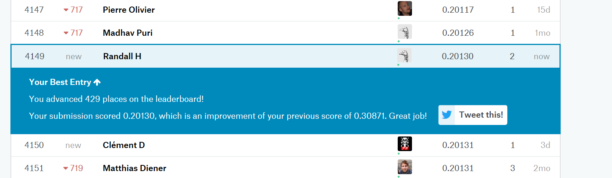

```{r setup, include=FALSE, echo=FALSE}
library(knitr)
knitr::opts_chunk$set(fig.path = 'images/', echo = FALSE)
```

\pagebreak

## Introduction

This is the final project for the semester in MSDS 6371 Statistical Foundation for Data Science, and is a group project.  It is based on the [Kaggle House Prices competition](https://www.kaggle.com/c/house-prices-advanced-regression-techniques).  Fundamentally we are seeking to answer what will the sale price of a house be based on some combination of predictive attribute measures of it.  The 2 specific questions below prescribe distinct approaches to answering this question.

## Data Description

As mentioned above, the data comes from the [Kaggle House Prices competition](https://www.kaggle.com/c/house-prices-advanced-regression-techniques).  The specific data sets we use for this project are the training data set (train.csv) to build the models, and test data set (test.csv) to cross-validate our models.

### train.csv

This dataset is roughly 450k with 1460 observations of 81 variables.  To read and understand more about this specific dataset please refer to the Kaggle website at [https://www.kaggle.com/c/house-prices-advanced-regression-techniques/data](https://www.kaggle.com/c/house-prices-advanced-regression-techniques/data).

### test.csv

This dataset, is roughly 441k with 1459 observation of 80 variables.  This has one less observation: SalePrice.  This is due to the fact it is meant to be used for cross-validation, and does not require this variable because we are meant to predict that with our models.

### Primary Variables

The following variables are fundamental to the answer for Question 1, do not contain missing values, and require no cleaning:
* SalePrice - the property's sale price in dollars
* GrLivArea - Above grade (ground) living area square feet
* Neighborhood - Physical locations within Ames city limits

## Question 1

### The Problem

Ames Century 21 real estate would like us to perform the following analysis of homes:

For the neighborhoods of: BrkSide, Edwards and NAmes, please find a predictive model for home SalePrice based on GrLivArea.  Provide the model assumptions assessment with evidence, as well as data review and outlier analysis.  Please provide estimate or estimates with confidence intervals, and a written conclusion of the relationship of GrLivArea and SalePrice within these neighborhoods.

### Build and Fit the Model

#### Untransformed Data

```
SalePrice = beta0 + beta1*GrLivArea + beta2*d1 + beta3*d2 + beta4*d3 + beta5*int1 + beta6*int2 + beta7*int3
```

When looking at plots of the raw data, there is a clear linear relationship between GrLivArea and SalePrice on Image 001.  However, on Image 002 we can see several issues with the data:
* unequal spread on Residual vs Predicted and Studentized Residual vs Predicted, looks like the variance is increasing
* the qqplot is curved and the histogram is rather large in the middle suggesting non-normal data
* Cooks-D and Leverage show points that may have leverage and should be investigated

When looking at Image 003, most of the parameter estimates look good except for d3, int2 and int3.  The VIF for all estimates are high, the smallest being 22.  This is another sign that outliers should be investigated.

We need to perform outlier analysis and perform transformations to address equal deviation and normality.

#### Other Transformations

Log-Linear, and Linear_log were both experimented with.  None of the violations were addressed using any of these methods.  In some cases, it made the linear relationship worse with SalePrice.  For brevity, no graphs are provided for these transformations.

#### Log-Log Transformed Data

```
SalePrice = beta0 + beta1 * LogGrLivArea + beta3*d2 + beta4*d3 + beta6*centLint2 + beta7*centLint3
```

For brevity, some of the iterative process for analyzing the data is omitted, but summarized here.  It was found that there was no statistical difference between the BrkSide and Edwards neighborhoods, so these were combined into a single entity.  Also, to address the high VIF values, the interaction variables were centered.

### Assumptions
When looking at the Log-Log transformed data in Image 004, the linear relationship looks much better.  Also,, when looking at the fit diagnostics in Image 005, we can see that the assumptions are addressed:
1.There is a clear linear trend with explanatory variables with the LogSalePrice
1. The histogram looks better and the QQ plot as well, combined with the large number of observations, we can say the data is normal
1. All residual plots look like a good random cloud with equal variance across the graph
1. For independence, we do not know how the data were collected, and will assume that they are independent

The fit diagnostics in Image 005 and Regression statistics in Image 006 display that all issues are addressed with the data.

#### Outlier Analysis

After analyzing the scatter plots, we noticed the two observations that were from homes over 4500 square feet.  Since these two observations have high leverage, we decided to try to find other effects these observations might have. Looking at the group ranking of these observations we decided to remove these observations due to the effect these had on our model assumptions.  We were more interested in the observations that were centered around the middle of the ranking.

Additionally, the GrLivArea of these observations for the Edwards Neighborhood is thought to be not representative of this area.  These values were extremely above the third quartile.  Give this we justified removing these observations.

### Comparison of Competing Models

| Models        | Adjusted R^2 | CV Press    |
|---------------|--------------|-------------|
| Untransformed | 0.5696       | 4.00198 E12 |
| Log-Log       | 0.5808       | 97.939      |

Image 007 and Image 008 capture the SAS output for the Untransformed and Log-Log transformed models respectively.

#### Models
1. `SalePrice    = 19972  +  87.163*GrLivArea   +  68382*d1  + 54705*d2  +  -12416*d3  +  -57.412*int1  +  -32.847*int2  +  31.351*int3`
1. `LogSalePrice = 5.844  +  0.845*LogGrLivArea +  0.094*d2  + 0.219*d3  +  -0.268*centLint2  +  0.169*centLint3`

### Parameters
* Estimates - refer to model #2 above for the parameter estimates
* Interpretation
    * Reference category: BrkSide+Edwards
        * beta0 - The median SalePrice of houses that are located either in the Neighborhoods of BrkSide or Edwards,and has the GrLivArea of 1
        * beta1 - Doubling the GrLivArea is associated with 1.796 increase of the median SalePrice, roughly a 79.6% increase in median price.
    * Category: NAmes
        * beta2 - The difference between the median price of a house in NAmes and BrkSide+Edwards neighborhoods, that has a GrLivArea of 1
        * beta4 - The difference in slope of the regression line of LogGrLivArea when Neighborhood is NAmes and the slope when the Neighborhood is equal to BrkSide+Edwards.
    * Category: Others
        * beta3 - The difference between the median price of a house in Others and BrkSide+Edwards neighborhoods, that has a GrLivArea of 1
        * beta5 - The difference in slope of the regression line of LogGrLivArea when Neighborhood is Others and the slope when the Neighborhood is equal to BrkSide+Edwards.
* Confidence Intervals - refer to Image 007 for 95% confidence interval for the individual parameters.

### Conclusion

The relationship between SalePrice on GrLivArea of houses in the BrkSide and Edwards Neighborhoods were not found to be significantly different.  In general, when you double the GrLivArea of a house in the BrkSide and Edwards Neighborhoods, the median SalePrice increases by a factor of 79.6%.  The 95% confidence interval for this increase is between a 72% and 82.4% increase in median SalePrice.

The NAmes Neighborhood starting median price is about 10% more than the BrkSide and Edwards Neighborhoods.  A doubling of the GrLivArea of houses in this Neighborhood is associated with a 49.2% increase in the median SalePrice.  The 95% confidence interval for this increase in between a 32% and 69% increase in median SalePrice.

Because this was an observational study any causal inferences made from this would be speculative.  But we can say there is a correlation between SalePrice and GrLivArea for this population of homes in Ames, Iowa.

\pagebreak

## Question 2
### The Problem
Ames Century 21 real estate would like us to perform the following analysis of homes:

Build the most predictive model for sales prices of homes in all of Ames Iowa.  By using  4 models: one from forward selection, one from backwards elimination, one from stepwise selection, and one the build custom.  

The custom model is one of the three preceding models .  The  custom model  is the best in terms of being able to predict future sale prices of homes .


### Model Selection Process

1. We ran heat map of correlation between sales price and the different numerical variables 
2. we shortlisted the  variables that has highest correlation with Sales price.
3. Then we did log transformation on all numeric variables  and again check the correlation with sales price.Then identified some more 
   variables that has high correlation with sales price.
4. After performing above step, we identify to 10 variables that has high correlation with sales price.
5. Then we did the matrix scatter plot between these 10 variables and sales price, to visualize the correlation between sales price and     these variables; and visualize the correlation between explanatory variables.
6. We also found that among categorical variable ,neighbor hood and sales condition were relevant to predict the sales price . Adding them to the model , increased adjusted r^2 and decreased the RMSE. 
7. We removed outlier in variable GrLivArea that has < 4000 and all the relevant  variable is given to subset selection process.
7. We selected the model that has lowest cp score.That are Neighborhood, Sale Condition, OverallQual, LogLotArea, LogGrLiving, LogGarArea, LogTotalBsmtSF  and YearBuilt.
8. We  passed the same variable to  Forward/Backward/Stepwise  and we got same parameters back . All were significant.
9. We ran this model in SAS to validate model assumptions and we found the observations( # 31,411,632 and 1417) having high Studentized residuals that has 5 SD away. We investigated these observations and decided to delete them.
10 . Then reran the model and found out that all the assumptions has met
11. We ran the cross validation on the training data set  and then obtain relevant cv test score.
12. We added sales price column to test data set,then ran the model . The observations and Predictions are inserted into a result data set, which was presented to Kaggles and results were given by Kaggle score . The results are shared in conclusion section.


#### Forward

##### Assumptions
The Forward selection model is satisfying all below condition after performing transformation on some of the variables.
* Linear Trend (Plots: Response vs Explanatory, Explanatory vs Explanatory)
* Normality (Residual: Scatter, QQ Plot, Histogram)
* Equal Standard Deviation (Residual Scatter Plots)

#### Backward

##### Assumptions
* Linear Trend (Plots: Response vs Explanatory, Explanatory vs Explanatory)
* Normality (Residual: Scatter, QQ Plot, Histogram)
* Equal Standard Deviation (Residual Scatter Plots)


#### Stepwise

##### Assumptions
* Linear Trend (Plots: Response vs Explanatory, Explanatory vs Explanatory)
* Normality (Residual: Scatter, QQ Plot, Histogram)
* Equal Standard Deviation (Residual Scatter Plots)

#### Custom

##### Assumptions
* Linear Trend (Plots: Response vs Explanatory, Explanatory vs Explanatory)
* Normality (Residual: Scatter, QQ Plot, Histogram)
* Equal Standard Deviation (Residual Scatter Plots)

### Comparison of Models
| Predictive Models | Adusted R^2 | CV Press | Kaggle Score |
|-------------------|:-----------:|:--------:|:------------:|
| Forward           | 0.8801      | 23.2     | .201         |
| Backward          | 0.8801      | 23.2     | .201         |
| Stepwise          | 0.8801      | 23.2     | .201         |
| Custom*           | 0.8801      | 23.2     | .201         |
 
 * custom method chosen was Forward(select=SL)
### Conclusion
Based on above table , all the models selection is deriving similar results . Any way we are going ahead with Stepwise model for deriving conclusion.

LogSalePrice=Neighborhood SaleCondition OverallQual LogLotArea LogGrLiving LogGarArea LogTotalBsmtSF YearBuilt 

This model has adjusted R^2 =.8801 , CV Press=23.2  and RMSE=.021 , this model fulfill all the assumptions of the multiple linear regression , that are 
1. Residual: Scatter, QQ Plot, Histogram
2. Equal Standard Deviation (Residual Scatter Plots)
3. Cooks D is looking good.
4. We assume there is independence.

### The Kaggle score is .201

{width=12,height=8}


\pagebreak


## Appendix

## Question 1 SAS Code

```
/* Data Sets: 
   - Train0 - Kaggle Training Data Set 
   - TrainRed - Kaggle Training Data Set Reduced for question 1  
*/ 
filename CSV URL "https://dl.dropboxusercontent.com/spa/afq05cp80hp4ezn/downloads/public/msds-data/train.csv";

data TRAIN0;
%let _EFIERR_ = 0; /* set the ERROR detection macro variable */
infile CSV
delimiter = ',' MISSOVER DSD lrecl=32767 firstobs=2 ;
/* note regex used : \d\d\d[ ]* */
  informat Id 4. ;
  informat MSSubClass $3. ;
  informat MSZoning $7. ;  /* #31 c (all) */
  informat LotFrontage best32. ;
  informat LotArea best32. ;
  informat Street $4. ;
  informat Alley $4. ;
  informat LotShape $3. ;
  informat LandContour $3. ;
  informat Utilities $6. ;
  informat LotConfig $7. ;
  informat LandSlope $3. ;
  informat Neighborhood $7. ;
  informat Condition1 $6. ;
  informat Condition2 $6. ;
  informat BldgType $6. ;
  informat HouseStyle $6. ;
  informat OverallQual best32. ;
  informat OverallCond best32. ;
  informat YearBuilt best32. ;
  informat YearRemodAdd best32. ;
  informat RoofStyle $7. ;
  informat RoofMatl $7. ;
  informat Exterior1st $7. ;
  informat Exterior2nd $7. ;
  informat MasVnrType $7. ;
  informat MasVnrArea best32. ;
  informat ExterQual $2. ;
  informat ExterCond $2. ;
  informat Foundation $6. ;
  informat BsmtQual $2. ;
  informat BsmtCond $2. ;
  informat BsmtExposure $2. ;
  informat BsmtFinType1 $3. ;
  informat BsmtFinSF1 best32. ;
  informat BsmtFinType2 $3. ;
  informat BsmtFinSF2 best32. ;
  informat BsmtUnfSF best32. ;
  informat TotalBsmtSF best32. ;
  informat Heating $5. ;
  informat HeatingQC $2. ;
  informat CentralAir $1. ;
  informat Electrical $5. ;
  informat _1stFlrSF best32. ;
  informat _2ndFlrSF best32. ;
  informat LowQualFinSF best32. ;
  informat GrLivArea best32. ;
  informat BsmtFullBath best32. ;
  informat BsmtHalfBath best32. ;
  informat FullBath best32. ;
  informat HalfBath best32. ;
  informat BedroomAbvGr best32. ;
  informat KitchenAbvGr best32. ;
  informat KitchenQual $2. ;
  informat TotRmsAbvGrd best32. ;
  informat Functional $4. ;
  informat Fireplaces best32. ;
  informat FireplaceQu $2. ;
  informat GarageType $7. ;
  informat GarageYrBlt best32. ;
  informat GarageFinish $3. ;
  informat GarageCars best32. ;
  informat GarageArea best32. ;
  informat GarageQual $2. ;
  informat GarageCond $2. ;
  informat PavedDrive $1. ;
  informat WoodDeckSF best32. ;
  informat OpenPorchSF best32. ;
  informat EnclosedPorch best32. ;
  informat _3SsnPorch best32. ;
  informat ScreenPorch best32. ;
  informat PoolArea best32. ;
  informat PoolQC $2. ;
  informat Fence $5. ;
  informat MiscFeature $4. ;
  informat MiscVal best32. ;
  informat MoSold best32. ;
  informat YrSold best32. ;
  informat SaleType $5. ;
  informat SaleCondition $7. ;
  informat SalePrice best32. ;
  format Id 4. ;
  format MSSubClass $3. ;
  format MSZoning $2. ;
  format LotFrontage best12. ;
  format LotArea best12. ;
  format Street $4. ;
  format Alley $4. ;
  format LotShape $3. ;
  format LandContour $3. ;
  format Utilities $6. ;
  format LotConfig $7. ;
  format LandSlope $3. ;
  format Neighborhood $7. ;
  format Condition1 $6. ;
  format Condition2 $6. ;
  format BldgType $6. ;
  format HouseStyle $6. ;
  format OverallQual best12. ;
  format OverallCond best12. ;
  format YearBuilt best12. ;
  format YearRemodAdd best12. ;
  format RoofStyle $7. ;
  format RoofMatl $7. ;
  format Exterior1st $7. ;
  format Exterior2nd $7. ;
  format MasVnrType $7. ;
  format MasVnrArea best12. ;
  format ExterQual $2. ;
  format ExterCond $2. ;
  format Foundation $6. ;
  format BsmtQual $2. ;
  format BsmtCond $2. ;
  format BsmtExposure $2. ;
  format BsmtFinType1 $3. ;
  format BsmtFinSF1 best12. ;
  format BsmtFinType2 $3. ;
  format BsmtFinSF2 best12. ;
  format BsmtUnfSF best12. ;
  format TotalBsmtSF best12. ;
  format Heating $5. ;
  format HeatingQC $2. ;
  format CentralAir $1. ;
  format Electrical $5. ;
  format _1stFlrSF best12. ;
  format _2ndFlrSF best12. ;
  format LowQualFinSF best12. ;
  format GrLivArea best12. ;
  format BsmtFullBath best12. ;
  format BsmtHalfBath best12. ;
  format FullBath best12. ;
  format HalfBath best12. ;
  format BedroomAbvGr best12. ;
  format KitchenAbvGr best12. ;
  format KitchenQual $2. ;
  format TotRmsAbvGrd best12. ;
  format Functional $4. ;
  format Fireplaces best12. ;
  format FireplaceQu $2. ;
  format GarageType $7. ;
  format GarageYrBlt best12. ;
  format GarageFinish $3. ;
  format GarageCars best12. ;
  format GarageArea best12. ;
  format GarageQual $2. ;
  format GarageCond $2. ;
  format PavedDrive $1. ;
  format WoodDeckSF best12. ;
  format OpenPorchSF best12. ;
  format EnclosedPorch best12. ;
  format _3SsnPorch best12. ;
  format ScreenPorch best12. ;
  format PoolArea best12. ;
  format PoolQC $2. ;
  format Fence $5. ;
  format MiscFeature $4. ;
  format MiscVal best12. ;
  format MoSold best12. ;
  format YrSold best12. ;
  format SaleType $5. ;
  format SaleCondition $7. ;
  format SalePrice best12. ;
input
  Id
  MSSubClass
  MSZoning $
  LotFrontage $
  LotArea
  Street $
  Alley $
  LotShape $
  LandContour $
  Utilities $
  LotConfig $
  LandSlope $
  Neighborhood $
  Condition1 $
  Condition2 $
  BldgType $
  HouseStyle $
  OverallQual
  OverallCond
  YearBuilt
  YearRemodAdd
  RoofStyle $
  RoofMatl $
  Exterior1st $
  Exterior2nd $
  MasVnrType $
  MasVnrArea $
  ExterQual $
  ExterCond $
  Foundation $
  BsmtQual $
  BsmtCond $
  BsmtExposure $
  BsmtFinType1 $
  BsmtFinSF1
  BsmtFinType2 $
  BsmtFinSF2
  BsmtUnfSF
  TotalBsmtSF
  Heating $
  HeatingQC $
  CentralAir $
  Electrical $
  _1stFlrSF
  _2ndFlrSF
  LowQualFinSF
  GrLivArea
  BsmtFullBath
  BsmtHalfBath
  FullBath
  HalfBath
  BedroomAbvGr
  KitchenAbvGr
  KitchenQual $
  TotRmsAbvGrd
  Functional $
  Fireplaces
  FireplaceQu $
  GarageType $
  GarageYrBlt $
  GarageFinish $
  GarageCars
  GarageArea
  GarageQual $
  GarageCond $
  PavedDrive $
  WoodDeckSF
  OpenPorchSF
  EnclosedPorch
  _3SsnPorch
  ScreenPorch
  PoolArea
  PoolQC $
  Fence $
  MiscFeature $
  MiscVal
  MoSold
  YrSold
  SaleType $
  SaleCondition $
  SalePrice
;
if _ERROR_ then call symputx('_EFIERR_',1);  /* set ERROR detection macro variable */
run;

/* **************************************** */
/* DATA CLEANUP - use proc means to show missing values*/
/* **************************************** */
title "Train0 - Data Set Missing Values";
proc means data=train0 nmiss n; run;

/* fix missing values */
data train0;
  set train0;
  if missing(LotFrontage) then LotFrontage = 0;
run;

title "Train0 - Data Set Fixed Missing Values";
proc means data=train0 nmiss n; run;

title "Train0 - First 10";
proc print data=train0 (obs=10);
run;
title "";
/* **************************************** */
/* END DATA CLEANUP - after second proc means, no missing values */
/* **************************************** */
/********************************/
/** train0 is for Question 2  ***/
/** trainraw3 is Q1 Unmodified **/
/**       / Untransformed Data **/
/********************************/
data train0raw;
  set train0 (keep=Id Neighborhood GrLivArea SalePrice);

  select (Neighborhood);
    when ("NAmes")   Nei=Neighborhood;
    when ("Edwards") Nei=Neighborhood;
    when ("BrkSide") Nei=Neighborhood;
    otherwise Nei="Others";
  end;
  
  if Nei="Edwards" then d1=1; else d1=0;
  if Nei="NAmes"   then d2=1; else d2=0;
  if Nei="Others"  then d3=1; else d3=0;
  
  int1 = d1 * GrLivArea; 
  int2 = d2 * GrLivArea; 
  int3 = d3 * GrLivArea;
run;

proc sort data=train0raw;
  by descending GrLivArea;
run;

proc means data=train0raw;
  var GrLivArea d1 d2 d3;
run;

proc sgscatter data=train0raw;
  plot SalePrice*GrLivArea / group=Nei reg;
run;
/**************************************************/
/*************     Model Building      ************/
/* Residual Plot showing possible unequal spread) */
/* Model for Untransformed Data */
proc glm data=train0raw plots=all;
  class Nei(ref="BrkSide");
  model SalePrice=GrLivArea d1 d2 d3 int1 int2 int3 | Nei / solution VIF;
  TITLE "Non Transformed";
run;

proc reg data=train0raw plots=all;
  model SalePrice = GrLivArea d1 d2 d3 int1 int2 int3 / VIF;
  TITLE "Un-Transformed Data";
run;
/******************************************************************************/
/************* Question 1 Tranformed Data *************************************/
/******************************************************************************/
/*************************************************/
/** train0 is for Question 1 - final model data **/
/**        outliers are removed as well         **/
/*************************************************/
data trainRed;
  set train0 (keep=Id Neighborhood GrLivArea SalePrice);

  select (Neighborhood);
    when ("NAmes") Nei=Neighborhood;
    when ("Edwards") Nei="EdwardP";
    when ("BrkSide") Nei="EdwardP";
    otherwise Nei="Others";
  end;

  /* Remove outliers */
  if GrLivArea < 4500;
  /* make sure we do not include missing values */
  if GrLivArea > 0;
  /* make sure we do not include missing values and we dont take log of zero */
  if SalePrice > 0;
    logSales=log(SalePrice);
    logLiv=log(GrLivArea);

  if Nei="NAmes"  then d2=1; else d2=0;
  if Nei="Others" then d3=1; else d3=0;

  l_int2 = d2 * logLiv; 
  l_int3 = d3 * logLiv;
  
  centLint2=(logLiv - 7.2660236) * (d2 - 0.1543210);
  centLint3=(logLiv - 7.2660236) * (d3 - 0.7386831);
run;

proc sort data=trainRed;
  by descending logLiv;
run;

proc means data=trainRed;
  var logLiv d2 d3;
run;


proc sgscatter data=trainRed;
  plot logSales*logLiv / reg;
  TITLE "Log-Log Transformed Data";
run;

/**************************************************/
/*************     Model Building      ************/

proc glm data=trainRed plots=all;
  class Nei(ref="EdwardP");
  model logSales=logLiv | Nei / solution;
  TITLE "Log-Log Transformed Data";
run;

proc reg data=trainRed plots=all;
  model logSales=logLiv d2 d3 centLint2 centLint3 / VIF;
  TITLE "Log-Log Transformed Data";
run;

/**************************************************/
/*************     Model Comparison   *************/
proc reg data=train0raw plots=all;
  model SalePrice = GrLivArea d1 d2 d3 int1 int2 int3 / PRESS VIF CLM P;
  TITLE "Un-Transformed Data";
run;

proc reg data=trainRed plots=all;
  model logSales=logLiv d2 d3 centLint2 centLint3 / PRESS VIF CLM P;
  TITLE "Log-Log Transformed Data";
run;
```

## Question 1 Plots of Untransformed Data

## Image 001


## Image 002


## Image 003


----

## Question 1 Plots of Log-Log Data

### Image 004


### Image 005


### Image 006


## Question 1 Miscellaneous Plots

### Image 007


### Image 008


----

### Question 2


### Training Code

```  

/* 
Data Sets: 
- Train0 - Kaggle Training Data Set 
- TrainRed - Kaggle Training Data Set Reduced for question 1  
*/ 

filename CSV URL "https://dl.dropboxusercontent.com/spa/afq05cp80hp4ezn/downloads/public/msds-data/train.csv";


data TRAIN0;
%let _EFIERR_ = 0; /* set the ERROR detection macro variable */
infile CSV
delimiter = ',' MISSOVER DSD lrecl=32767 firstobs=2 ;
/* note regex used : \d\d\d[ ]* */
  informat Id 4. ;
  informat MSSubClass $3. ;
  informat MSZoning $7. ;  /* #31 c (all) */
  informat LotFrontage best32. ;
  informat LotArea best32. ;
  informat Street $4. ;
  informat Alley $4. ;
  informat LotShape $3. ;
  informat LandContour $3. ;
  informat Utilities $6. ;
  informat LotConfig $7. ;
  informat LandSlope $3. ;
  informat Neighborhood $7. ;
  informat Condition1 $6. ;
  informat Condition2 $6. ;
  informat BldgType $6. ;
  informat HouseStyle $6. ;
  informat OverallQual best32. ;
  informat OverallCond best32. ;
  informat YearBuilt best32. ;
  informat YearRemodAdd best32. ;
  informat RoofStyle $7. ;
  informat RoofMatl $7. ;
  informat Exterior1st $7. ;
  informat Exterior2nd $7. ;
  informat MasVnrType $7. ;
  informat MasVnrArea best32. ;
  informat ExterQual $2. ;
  informat ExterCond $2. ;
  informat Foundation $6. ;
  informat BsmtQual $2. ;
  informat BsmtCond $2. ;
  informat BsmtExposure $2. ;
  informat BsmtFinType1 $3. ;
  informat BsmtFinSF1 best32. ;
  informat BsmtFinType2 $3. ;
  informat BsmtFinSF2 best32. ;
  informat BsmtUnfSF best32. ;
  informat TotalBsmtSF best32. ;
  informat Heating $5. ;
  informat HeatingQC $2. ;
  informat CentralAir $1. ;
  informat Electrical $5. ;
  informat _1stFlrSF best32. ;
  informat _2ndFlrSF best32. ;
  informat LowQualFinSF best32. ;
  informat GrLivArea best32. ;
  informat BsmtFullBath best32. ;
  informat BsmtHalfBath best32. ;
  informat FullBath best32. ;
  informat HalfBath best32. ;
  informat BedroomAbvGr best32. ;
  informat KitchenAbvGr best32. ;
  informat KitchenQual $2. ;
  informat TotRmsAbvGrd best32. ;
  informat Functional $4. ;
  informat Fireplaces best32. ;
  informat FireplaceQu $2. ;
  informat GarageType $7. ;
  informat GarageYrBlt best32. ;
  informat GarageFinish $3. ;
  informat GarageCars best32. ;
  informat GarageArea best32. ;
  informat GarageQual $2. ;
  informat GarageCond $2. ;
  informat PavedDrive $1. ;
  informat WoodDeckSF best32. ;
  informat OpenPorchSF best32. ;
  informat EnclosedPorch best32. ;
  informat _3SsnPorch best32. ;
  informat ScreenPorch best32. ;
  informat PoolArea best32. ;
  informat PoolQC $2. ;
  informat Fence $5. ;
  informat MiscFeature $4. ;
  informat MiscVal best32. ;
  informat MoSold best32. ;
  informat YrSold best32. ;
  informat SaleType $5. ;
  informat SaleCondition $7. ;
  informat SalePrice best32. ;
  format Id 4. ;
  format MSSubClass $3. ;
  format MSZoning $2. ;
  format LotFrontage best12. ;
  format LotArea best12. ;
  format Street $4. ;
  format Alley $4. ;
  format LotShape $3. ;
  format LandContour $3. ;
  format Utilities $6. ;
  format LotConfig $7. ;
  format LandSlope $3. ;
  format Neighborhood $7. ;
  format Condition1 $6. ;
  format Condition2 $6. ;
  format BldgType $6. ;
  format HouseStyle $6. ;
  format OverallQual best12. ;
  format OverallCond best12. ;
  format YearBuilt best12. ;
  format YearRemodAdd best12. ;
  format RoofStyle $7. ;
  format RoofMatl $7. ;
  format Exterior1st $7. ;
  format Exterior2nd $7. ;
  format MasVnrType $7. ;
  format MasVnrArea best12. ;
  format ExterQual $2. ;
  format ExterCond $2. ;
  format Foundation $6. ;
  format BsmtQual $2. ;
  format BsmtCond $2. ;
  format BsmtExposure $2. ;
  format BsmtFinType1 $3. ;
  format BsmtFinSF1 best12. ;
  format BsmtFinType2 $3. ;
  format BsmtFinSF2 best12. ;
  format BsmtUnfSF best12. ;
  format TotalBsmtSF best12. ;
  format Heating $5. ;
  format HeatingQC $2. ;
  format CentralAir $1. ;
  format Electrical $5. ;
  format _1stFlrSF best12. ;
  format _2ndFlrSF best12. ;
  format LowQualFinSF best12. ;
  format GrLivArea best12. ;
  format BsmtFullBath best12. ;
  format BsmtHalfBath best12. ;
  format FullBath best12. ;
  format HalfBath best12. ;
  format BedroomAbvGr best12. ;
  format KitchenAbvGr best12. ;
  format KitchenQual $2. ;
  format TotRmsAbvGrd best12. ;
  format Functional $4. ;
  format Fireplaces best12. ;
  format FireplaceQu $2. ;
  format GarageType $7. ;
  format GarageYrBlt best12. ;
  format GarageFinish $3. ;
  format GarageCars best12. ;
  format GarageArea best12. ;
  format GarageQual $2. ;
  format GarageCond $2. ;
  format PavedDrive $1. ;
  format WoodDeckSF best12. ;
  format OpenPorchSF best12. ;
  format EnclosedPorch best12. ;
  format _3SsnPorch best12. ;
  format ScreenPorch best12. ;
  format PoolArea best12. ;
  format PoolQC $2. ;
  format Fence $5. ;
  format MiscFeature $4. ;
  format MiscVal best12. ;
  format MoSold best12. ;
  format YrSold best12. ;
  format SaleType $5. ;
  format SaleCondition $7. ;
  format SalePrice best12. ;
input
  Id
  MSSubClass
  MSZoning $
  LotFrontage $
  LotArea
  Street $
  Alley $
  LotShape $
  LandContour $
  Utilities $
  LotConfig $
  LandSlope $
  Neighborhood $
  Condition1 $
  Condition2 $
  BldgType $
  HouseStyle $
  OverallQual
  OverallCond
  YearBuilt
  YearRemodAdd
  RoofStyle $
  RoofMatl $
  Exterior1st $
  Exterior2nd $
  MasVnrType $
  MasVnrArea $
  ExterQual $
  ExterCond $
  Foundation $
  BsmtQual $
  BsmtCond $
  BsmtExposure $
  BsmtFinType1 $
  BsmtFinSF1
  BsmtFinType2 $
  BsmtFinSF2
  BsmtUnfSF
  TotalBsmtSF
  Heating $
  HeatingQC $
  CentralAir $
  Electrical $
  _1stFlrSF
  _2ndFlrSF
  LowQualFinSF
  GrLivArea
  BsmtFullBath
  BsmtHalfBath
  FullBath
  HalfBath
  BedroomAbvGr
  KitchenAbvGr
  KitchenQual $
  TotRmsAbvGrd
  Functional $
  Fireplaces
  FireplaceQu $
  GarageType $
  GarageYrBlt $
  GarageFinish $
  GarageCars
  GarageArea
  GarageQual $
  GarageCond $
  PavedDrive $
  WoodDeckSF
  OpenPorchSF
  EnclosedPorch
  _3SsnPorch
  ScreenPorch
  PoolArea
  PoolQC $
  Fence $
  MiscFeature $
  MiscVal
  MoSold
  YrSold
  SaleType $
  SaleCondition $
  SalePrice
;
if _ERROR_ then call symputx('_EFIERR_',1);  /* set ERROR detection macro variable */
run;


/* **************************************** */
/* DATA CLEANUP - use proc means to show missing values*/
/* **************************************** */

title "Train0 - Data Set Missing Values";
proc means data=train0 nmiss n; run;

/* fix missing values */
data train0;
  set train0;
  if missing(LotFrontage) then LotFrontage = 0;
run;

title "Train0 - Data Set Fixed Missing Values";
proc means data=train0 nmiss n; run;

title "Train0 - First 10";
proc print data=train0 (obs=10);
run;
title "";

/* **************************************** */
/* END DATA CLEANUP - after second proc means, no missing values */
/* **************************************** */

/******************************/
/** train0 is for Question 2 **/
/******************************/
proc sgscatter data=train0;
  plot SalePrice*GrLivArea /group=Neighborhood;
run;

/******************************/
/** train0 is for Question 1 **/
/******************************/
data trainRed;
  set train0 (keep=Id Neighborhood GrLivArea SalePrice);

  select (Neighborhood);
    when ("NAmes") Nei=Neighborhood;
    when ("Edwards") Nei="EdwardPlusBrkSide";
    when ("BrkSide") Nei="EdwardPlusBrkSide";
    otherwise Nei="Others";
  end;

  if GrLivArea < 4500;
  If GrLivArea > 0;
  if SalePrice > 0;
    logSales=log(SalePrice);
    logLiv=log(GrLivArea);
  if Nei="NAmes" then 
    d2=1;
  else
    d2=0;

  if Nei="Others" then
    d3=1;
  else
    d3=0;

  int1 = d1 * GrLivArea; int2 = d2 * GrLivArea; int3 = d3 * GrLivArea;
  l_int1 = d1 * logLiv; l_int2 = d2 * logLiv; l_int3 = d3 * logLiv;
  centLint1 = (logLiv - 7.2660236) * (d1 - 0.0672154);
  centLint2=(logLiv - 7.2660236) * (d2 - 0.1543210);
  centLint3=(logLiv - 7.2660236) * (d3 - 0.7386831);
run;

proc sort data=trainRed;
  by descending GrLivArea;
run;

proc means data=trainRed;
  var GrLivArea logLiv d2 d3;
run;


proc sgscatter data=trainRed;
  where Nei="Edwards";
  plot SalePrice*GrLivArea / reg;
run;


/******************************************************************************/
/******************************************************************************/
/******************************************************************************/
/********************     Plot Transformed Data       *************************/


proc sgscatter data=trainRed;
  plot logSales*GrLivArea / group=Nei reg;
run;

/* Have Curvature */
proc sgscatter data=trainRed;
  plot SalePrice*logLiv / group=Nei reg;
run;

proc sgscatter data=trainRed;
  plot logSales*logLiv / group=Nei reg;
run;

/******************************************************************************/
/******************************************************************************/
/***********************     Model Building      ******************************/

/* Residual Plot showing possible unequal spread) */
/* Model for Untransformed Data */
proc glm data=trainRed plots=all;
  class Nei(ref="BrkSide");
  model SalePrice=GrLivArea | Nei / solution;
  TITLE "Non Transformed"; 
run;


/************************************/
/* Looks Ok as compared to Previous */
proc glm data=trainRed plots=all;
  class Nei(ref="BrkSide");
  model logSales=GrLivArea | Nei / solution;
  TITLE "Log-Linear Transformed Data"; 
run;

proc reg data=trainRed plots=all;
  model logSales=GrLivArea d1 d2 d3 int1 int2 int3/VIF;
run;

  /************************************/
proc glm data=trainRed plots=all;
  class Nei(ref="EdwardP");
  model logSales=logLiv | Nei / solution;
run;

proc reg data=trainRed plots=all;
  model logSales=logLiv d2 d3 centLint2 centLint3/VIF;
  run;


/******************************************************************************/
/******************************************************************************/
/******************************************************************************/
/******************************************************************************/


/* Create a Heatmap implementation of a correlation matrix */
  ods path work.mystore(update) sashelp.tmplmst(read);

proc template;
  define statgraph corrHeatmap;
    dynamic _Title;
    begingraph;
    entrytitle _Title;
    rangeattrmap name='map';

    /* select a series of colors that represent a "diverging"  */
    /* range of values: stronger on the ends, weaker in middle */
    /* Get ideas from http://colorbrewer.org                   */
    range -1 - 1 / rangecolormodel=(cxD8B365 cxF5F5F5 cx5AB4AC);
    endrangeattrmap;
    rangeattrvar var=r attrvar=r attrmap='map';
    layout overlay / xaxisopts=(display=(line ticks tickvalues)) 
      yaxisopts=(display=(line ticks tickvalues));
    heatmapparm x=x y=y colorresponse=r / xbinaxis=false ybinaxis=false 
      colormodel=THREECOLORRAMP name="heatmap" display=all;
    continuouslegend "heatmap" / orient=vertical location=outside 
      title="Pearson Correlation";
    endlayout;
    endgraph;
  end;
run;

/* Prepare the correlations coeff matrix: Pearson's r method */
%macro prepCorrData(in=, out=);
  /* Run corr matrix for input data, all numeric vars */
  proc corr data=&in. noprint pearson outp=work._tmpCorr vardef=df;
    with SalePrice;
  run;

  /* prep data for heatmap */
  data &out.;
    keep x y r;
    set work._tmpCorr(where=(_TYPE_="CORR"));
    array v{*} _numeric_;
    x=_NAME_;

    do i=dim(v) to 1 by -1;
      y=vname(v(i));
      r=v(i);

      /* creates a diagonally sparse matrix */
      if (i<_n_) then
        r=.;
      output;
    end;
  run;

  proc datasets lib=work nolist nowarn;
    delete _tmpcorr;
  quit;

%mend;

/* Build the graphs */
ods graphics /height=600 width=800 imagemap;
%prepCorrData(in=train0, out=out_r);

proc sgrender data=out_r template=corrHeatmap;
  dynamic _title="Corr matrix for SalePrice";
run;

proc corr data=train0;
  with SalePrice;
run;

data out_r;
  set out_r;
  modr=abs(r);
run;

proc sort data=out_r;
  by descending modr;
run;

proc print data=out_r;
run;

options validvarname=any;

proc corr data=train0 plots=matrix;
  var OverallQual GrLivArea GarageCars GarageArea TotalBsmtSF _1stFlrSF 
    FullBath TotRmsAbvGrd YearBuilt YearRemodAdd GarageYrBlt MasVnrArea 
    Fireplaces;
run;

proc sgscatter data=train0;
  matrix SalePrice OverallQual GrLivArea GarageCars;
run;

proc sgscatter data=train0;
  matrix SalePrice GarageArea TotalBsmtSF _1stFlrSF;
run;

proc sgscatter data=train0;
  matrix SalePrice FullBath TotRmsAbvGrd YearBuilt;
run;

proc sgscatter data=train0;
  matrix SalePrice YearRemodAdd GarageYrBlt MasVnrArea Fireplaces;
run;

/* Test Log Corr */
proc sort data=train0;
  by SalePrice;
run;

proc sgplot data=train0;
  scatter x=Neighborhood y=SalePrice;
run;

proc means data=train0 mean median;
  var saleprice;
  class Neighborhood;
run;

proc glm data=train0;
  class Neighborhood;
  model SalePrice=Neighborhood;
  means Neighborhood/HOVTEST=Levene;
  run;

data train0;
  set train0;
  if Neighborhood = "OldTown" then n1 = 1; else n1 = 0;
  if Neighborhood = "BrkSide" then n2 = 1; else n2 = 0;
  if Neighborhood = "Edwards" then n3 = 1; else n3 = 0;
  if Neighborhood = "SWISU" then n4 = 1; else n4 = 0;
  if Neighborhood = "Sawyer" then n5 = 1; else n5 = 0;
  if Neighborhood = "MeadowV" then n6 = 1; else n6 = 0;
  if Neighborhood = "SawyerW" then n7 = 1; else n7 = 0;
  if Neighborhood = "NWAmes" then n8 = 1; else n8 = 0;
  if Neighborhood = "Mitchel" then n9 = 1; else n9 = 0;
  if Neighborhood = "NAmes" then n10 = 1; else n10 = 0;
  if Neighborhood = "Crawfor" then n11 = 1; else n11 = 0;
  if Neighborhood = "CollgCr" then n12 = 1; else n12 = 0;
  if Neighborhood = "Blueste" then n13 = 1; else n13 = 0;
  if Neighborhood = "NPkVill" then n14 = 1; else n14 = 0;
  if Neighborhood = "ClearCr" then n15 = 1; else n15 = 0;
  if Neighborhood = "Timber" then n16 = 1; else n16 = 0;
  if Neighborhood = "Gilbert" then n17 = 1; else n17 = 0;
  if Neighborhood = "Somerst" then n18 = 1; else n18 = 0;
  if Neighborhood = "NridgHt" then n19 = 1; else n19 = 0;
  if Neighborhood = "Blmngtn" then n20 = 1; else n20 = 0;
  if Neighborhood = "Veenker" then n21 = 1; else n21 = 0;
  if Neighborhood = "StoneBr" then n22 = 1; else n22 = 0;
  if Neighborhood = "NoRidge" then n23 = 1; else n23 = 0;
  if SaleCondition = "Abnorml" then s1 = 1; else s1=0;
  if SaleCondition = "AdjLand" then s2 = 1; else s2=0;
  if SaleCondition = "Alloca" then s3 = 1; else s3=0;
  if SaleCondition = "Family" then s4 = 1; else s4=0;
  if SaleCondition = "Partial" then s5 = 1; else s5=0;
  if GrLivArea < 4000;

  if _n_ = 31 then delete;
  if _n_ = 411 then delete;
  if _n_ = 632 then delete;
  if _n_=1417 then delete;
run;

proc reg data=train0 plots=all;
  model SalePrice=n1 n2 n3 n4 n5 n6 n7 n8 n9 n10 n11 n12 n13 n14 n15 n16 n17 n18 
    n19 n20 n21 n22 n23/VIF;
run;

data train0;
  set train0;
  LogSalePrice=Log(SalePrice);  /* In */
  LogLotArea=Log(LotArea);  /* In */
  LogOverall=log(OverallQual);  /* out, WO Log is better*/
  LogGrLiving=log(GrLivArea);  /* In, Log is better */
  LogNumCarGar=log(GarageCars);  /* Out, WO Log is better */
  LogGarArea=log(GarageArea);  /* In */
  LogTotalBsmtSF=log(TotalBsmtSF);  /* In */
  Log1stFlrSF=Log(_1stFlrSF);  /* In */
  LogFullBath=log(FullBath);  /* Out, Use WO log */
  LogTotRmsAbvGrd=log(TotRmsAbvGrd);  /* Out, Use WO log */
  /*YearBuilt, YearRemodAdd, GarageYrBlt - No Need to Log */
  LogMasVnrArea=Log(MasVnrArea+1);  /* Potentially In */
 
  /*LogMasVnrArea = Log(MasVnrArea+1);
  LogBsmtFinSF1 = Log(BsmtFinSF1+1);
  Log1stFlrSF = Log(_1stFlrSF);
  LogPoolArea = Log(PoolArea+1);
  LogMiscVal = Log(MiscVal+1);
  LogGarageArea = Log(GarageArea);
  LogWoodDeckSF = Log(WoodDeckSF+1);
  LogOpenPorchSF = Log(OpenPorchSF+1);
  LogEnclosedPorch = Log(EnclosedPorch+1);
  Log3SsnPorch = Log(_3SsnPorch+1);
  LogScreenPorch = Log(ScreenPorch+1);*/
run;

proc sgscatter data=train0;
  matrix LogSalePrice FullBath LogTotalBsmtSF Log1stFlrSF;
run;

proc reg data=train0 plots=all;
  model LogSalePrice=n1 n2 n3 n4 n5 n6 n7 n8 n9 n10 n11 n12 n13 n14 n15 n16 n17 
    n18 n19 n20 n21 n22 n23 OverallQual LogLotArea LogGrLiving GarageCars 
    LogGarArea LogTotalBsmtSF Log1stFlrSF FullBath TotRmsAbvGrd YearBuilt 
    YearRemodAdd/vif;
run;

proc reg data=train0 plots=all;
  model LogSalePrice=n1 n2 n3 n4 n5 n6 n7 n8 n9 n10 n11 n12 n13 n14 n15 n16 n17 
    n18 n19 n20 n21 n22 n23 OverallQual LogLotArea LogGrLiving GarageCars 
    LogGarArea LogTotalBsmtSF Log1stFlrSF FullBath TotRmsAbvGrd YearBuilt 
    YearRemodAdd/vif;
run;

  /* Investigating the Corr among vars, Remove LogFirstSF, LogTotalBsmtSF, TotRmsAbvGrd,LogLotArea area(corr with Gr Living Area),  */
proc sgscatter data=train0;
  matrix OverallQual LogLotArea LogGrLiving GarageCars LogGarArea FullBath 
    YearBuilt YearRemodAdd;
run;

proc sgscatter data=train0;
  plot LogSalePrice *LogGarArea/reg;
run;

proc corr data=train0;
  var LogGarArea GarageCars;
run;

proc reg data=train0 plots(label)=all;
  model LogSalePrice=n1 n2 n3 n4 n5 n6 n7 n8 n9 n10 n11 n12 n13 n14 n15 n16 n17 
    n18 n19 n20 n21 n22 n23 OverallQual LogGrLiving GarageCars LogGarArea 
    FullBath YearBuilt YearRemodAdd/vif;
run;

  /* Initial Model By Manual */
proc glm data=train0 plots=all;
  class Neighborhood;
  model LogSalePrice=Neighborhood OverallQual LogGrLiving GarageCars LogGarArea 
    FullBath YearBuilt YearRemodAdd;
run;

proc glmselect data=train0;
  class Neighborhood;
  model LogSalePrice=Neighborhood OverallQual LogLotArea LogGrLiving GarageCars 
    LogGarArea LogTotalBsmtSF Log1stFlrSF FullBath TotRmsAbvGrd YearBuilt 
    YearRemodAdd/selection=stepwise stats=ALL;
run;

proc reg data=train0;
  model LogSalePrice=n1 n2 n3 n4 n5 n6 n7 n8 n9 n10 n11 n12 n13 n14 n15 n16 n17 
    n18 n19 n20 n21 n22 n23 s1 s2 s3 s4 s5 OverallQual LogLotArea LogGrLiving 
    LogGarArea LogTotalBsmtSF Log1stFlrSF TotRmsAbvGrd YearBuilt 
    YearRemodAdd/selection=cp;
  output out=t cookd=cookd;
  plot cp.*np./cmallows=blue vaxis=0 to 15 by 5;
run;

proc reg data=train0 plots(label)=all;
  model LogSalePrice=n1 n2 n3 n4 n5 n6 n7 n8 n9 n10 n11 n12 n13 n14 n15 n16 n17 
    n18 n19 n20 n21 n22 n23 s1 s2 s3 s4 s5 OverallQual LogLotArea LogGrLiving 
    LogGarArea LogTotalBsmtSF YearBuilt YearRemodAdd/vif;
run;

  /* Adding additional Categorial Vars */
proc glmselect data=train0;
  class Neighborhood SaleCondition;
  model LogSalePrice=Neighborhood SaleCondition OverallQual LogLotArea 
    LogGrLiving LogGarArea LogTotalBsmtSF YearBuilt 
    YearRemodAdd/selection=stepwise stats=ALL;
run;

proc glmselect data=train0;
  class Neighborhood SaleCondition;
  model LogSalePrice=Neighborhood SaleCondition OverallQual LogLotArea 
    LogGrLiving LogGarArea LogTotalBsmtSF YearBuilt 
    YearRemodAdd/selection=stepwise(choose=CV stop=CV) CVDETAILS=ALL;
run;


```
### Test Code

```
/* 
Data Sets: 
- Test0 - Kaggle Test Data Set 
*/ 

filename CSV URL "https://dl.dropboxusercontent.com/spa/afq05cp80hp4ezn/downloads/public/msds-data/test.csv";

data TEST0;
%let _EFIERR_ = 0; /* set the ERROR detection macro variable */
infile CSV
delimiter = ',' MISSOVER DSD lrecl=32767 firstobs=2 ;
/* note regex used : \d\d\d[ ]* */
informat Id 4. ;
informat MSSubClass $3. ;
informat MSZoning $7. ;
informat LotFrontage best32. ;
informat LotArea best32. ;
informat Street $4. ;
informat Alley $4. ;
informat LotShape $3. ;
informat LandContour $3. ;
informat Utilities $6. ;
informat LotConfig $7. ;
informat LandSlope $3. ;
informat Neighborhood $7. ;
informat Condition1 $6. ;
informat Condition2 $6. ;
informat BldgType $6. ;
informat HouseStyle $6. ;
informat OverallQual best32. ;
informat OverallCond best32. ;
informat YearBuilt best32. ;
informat YearRemodAdd best32. ;
informat RoofStyle $7. ;
informat RoofMatl $7. ;
informat Exterior1st $7. ;
informat Exterior2nd $7. ;
informat MasVnrType $7. ;
informat MasVnrArea best32. ;
informat ExterQual $2. ;
informat ExterCond $2. ;
informat Foundation $6. ;
informat BsmtQual $2. ;
informat BsmtCond $2. ;
informat BsmtExposure $2. ;
informat BsmtFinType1 $3. ;
informat BsmtFinSF1 best32. ;
informat BsmtFinType2 $3. ;
informat BsmtFinSF2 best32. ;
informat BsmtUnfSF best32. ;
informat TotalBsmtSF best32. ;
informat Heating $5. ;
informat HeatingQC $2. ;
informat CentralAir $1. ;
informat Electrical $5. ;
informat _1stFlrSF best32. ;
informat _2ndFlrSF best32. ;
informat LowQualFinSF best32. ;
informat GrLivArea best32. ;
informat BsmtFullBath best32. ;
informat BsmtHalfBath best32. ;
informat FullBath best32. ;
informat HalfBath best32. ;
informat BedroomAbvGr best32. ;
informat KitchenAbvGr best32. ;
informat KitchenQual $2. ;
informat TotRmsAbvGrd best32. ;
informat Functional $4. ;
informat Fireplaces best32. ;
informat FireplaceQu $2. ;
informat GarageType $7. ;
informat GarageYrBlt best32. ;
informat GarageFinish $3. ;
informat GarageCars best32. ;
informat GarageArea best32. ;
informat GarageQual $2. ;
informat GarageCond $2. ;
informat PavedDrive $1. ;
informat WoodDeckSF best32. ;
informat OpenPorchSF best32. ;
informat EnclosedPorch best32. ;
informat _3SsnPorch best32. ;
informat ScreenPorch best32. ;
informat PoolArea best32. ;
informat PoolQC $2. ;
informat Fence $5. ;
informat MiscFeature $4. ;
informat MiscVal best32. ;
informat MoSold best32. ;
informat YrSold best32. ;
informat SaleType $5. ;
informat SaleCondition $7. ;
format Id 4. ;
format MSSubClass $3. ;
format MSZoning $2. ;
format LotFrontage best12. ;
format LotArea best12. ;
format Street $4. ;
format Alley $4. ;
format LotShape $3. ;
format LandContour $3. ;
format Utilities $6. ;
format LotConfig $7. ;
format LandSlope $3. ;
format Neighborhood $7. ;
format Condition1 $6. ;
format Condition2 $6. ;
format BldgType $6. ;
format HouseStyle $6. ;
format OverallQual best12. ;
format OverallCond best12. ;
format YearBuilt best12. ;
format YearRemodAdd best12. ;
format RoofStyle $7. ;
format RoofMatl $7. ;
format Exterior1st $7. ;
format Exterior2nd $7. ;
format MasVnrType $7. ;
format MasVnrArea best12. ;
format ExterQual $2. ;
format ExterCond $2. ;
format Foundation $6. ;
format BsmtQual $2. ;
format BsmtCond $2. ;
format BsmtExposure $2. ;
format BsmtFinType1 $3. ;
format BsmtFinSF1 best12. ;
format BsmtFinType2 $3. ;
format BsmtFinSF2 best12. ;
format BsmtUnfSF best12. ;
format TotalBsmtSF best12. ;
format Heating $5. ;
format HeatingQC $2. ;
format CentralAir $1. ;
format Electrical $5. ;
format _1stFlrSF best12. ;
format _2ndFlrSF best12. ;
format LowQualFinSF best12. ;
format GrLivArea best12. ;
format BsmtFullBath best12. ;
format BsmtHalfBath best12. ;
format FullBath best12. ;
format HalfBath best12. ;
format BedroomAbvGr best12. ;
format KitchenAbvGr best12. ;
format KitchenQual $2. ;
format TotRmsAbvGrd best12. ;
format Functional $4. ;
format Fireplaces best12. ;
format FireplaceQu $2. ;
format GarageType $7. ;
format GarageYrBlt best12. ;
format GarageFinish $3. ;
format GarageCars best12. ;
format GarageArea best12. ;
format GarageQual $2. ;
format GarageCond $2. ;
format PavedDrive $1. ;
format WoodDeckSF best12. ;
format OpenPorchSF best12. ;
format EnclosedPorch best12. ;
format _3SsnPorch best12. ;
format ScreenPorch best12. ;
format PoolArea best12. ;
format PoolQC $2. ;
format Fence $5. ;
format MiscFeature $4. ;
format MiscVal best12. ;
format MoSold best12. ;
format YrSold best12. ;
format SaleType $5. ;
format SaleCondition $7. ;
input
Id
MSSubClass
MSZoning $
LotFrontage $
LotArea
Street $
Alley $
LotShape $
LandContour $
Utilities $
LotConfig $
LandSlope $
Neighborhood $
Condition1 $
Condition2 $
BldgType $
HouseStyle $
OverallQual
OverallCond
YearBuilt
YearRemodAdd
RoofStyle $
RoofMatl $
Exterior1st $
Exterior2nd $
MasVnrType $
MasVnrArea $
ExterQual $
ExterCond $
Foundation $
BsmtQual $
BsmtCond $
BsmtExposure $
BsmtFinType1 $
BsmtFinSF1 
BsmtFinType2 $
BsmtFinSF2 
BsmtUnfSF 
TotalBsmtSF 
Heating $
HeatingQC $
CentralAir $
Electrical $
_1stFlrSF
_2ndFlrSF
LowQualFinSF
GrLivArea
BsmtFullBath 
BsmtHalfBath 
FullBath
HalfBath
BedroomAbvGr
KitchenAbvGr
KitchenQual $
TotRmsAbvGrd
Functional $
Fireplaces
FireplaceQu $
GarageType $
GarageYrBlt $
GarageFinish $
GarageCars 
GarageArea 
GarageQual $
GarageCond $
PavedDrive $
WoodDeckSF
OpenPorchSF
EnclosedPorch
_3SsnPorch
ScreenPorch
PoolArea
PoolQC $
Fence $
MiscFeature $
MiscVal
MoSold
YrSold
SaleType $
SaleCondition $
;
if _ERROR_ then call symputx('_EFIERR_',1);  /* set ERROR detection macro variable */
run;


/* **************************************** */
/* DATA CLEANUP - use proc means to show missing values*/
/* **************************************** */

title "Test0 - Data Set Missing Values";
proc means data=test0 nmiss n; run;

/* fix missing values */
data test0;
  set test0;
  if missing(LotFrontage) then LotFrontage = 0;
  if missing(MasVnrArea) then MasVnrArea = 0;
  if missing(BsmtFinSF1) then BsmtFinSF1 = 0;
  if missing(BsmtFinSF2) then BsmtFinSF2 = 0;
  if missing(BsmtUnfSF) then BsmtUnfSF = 0;
  if missing(TotalBsmtSF) then TotalBsmtSF = 0;
  if missing(BsmtFullBath) then BsmtFullBath = 0;
  if missing(BsmtHalfBath) then BsmtHalfBath = 0;
  if missing(GarageCars) then GarageCars = 0;
  if missing(GarageArea) then GarageArea = 0;

  /* add log variables from Training model */
  *LogSalePrice=Log(SalePrice);  /* In */
  LogLotArea=Log(LotArea);  /* In */
  *LogOverall=log(OverallQual);  /* out, WO Log is better*/
  LogGrLiving=log(GrLivArea);  /* In, Log is better */
  *LogNumCarGar=log(GarageCars);  /* Out, WO Log is better */
  LogGarArea=log(GarageArea + 1);  /* In */
  LogTotalBsmtSF=log(TotalBsmtSF + 1);  /* In */
  Log1stFlrSF=Log(_1stFlrSF);  /* In */
  *LogFullBath=log(FullBath);  /* Out, Use WO log */
  *LogTotRmsAbvGrd=log(TotRmsAbvGrd);  /* Out, Use WO log */
  /*YearBuilt, YearRemodAdd, GarageYrBlt - No Need to Log */
  LogMasVnrArea=Log(MasVnrArea + 1);  /* Potentially In */
 
  /*LogMasVnrArea = Log(MasVnrArea+1);
  LogBsmtFinSF1 = Log(BsmtFinSF1+1);
  Log1stFlrSF = Log(_1stFlrSF);
  LogPoolArea = Log(PoolArea+1);
  LogMiscVal = Log(MiscVal+1);
  LogGarageArea = Log(GarageArea);
  LogWoodDeckSF = Log(WoodDeckSF+1);
  LogOpenPorchSF = Log(OpenPorchSF+1);
  LogEnclosedPorch = Log(EnclosedPorch+1);
  Log3SsnPorch = Log(_3SsnPorch+1);
  LogScreenPorch = Log(ScreenPorch+1);*/
run;

title "Test0 - Data Set Fixed Missing Values";
proc means data=test0 nmiss n; run;

title "Test0 - First 5";
proc print data=test0 (obs=5);
run;


```

### Prediction code

```
*FILENAME REFFILE_PREDICT 'c:\temp\kaggle_predict.csv'; 

/* 
   MSDS6371 - Kaggle Submission 

   The Train0 and Test0 data sets have been loaded and cleaned. 

   1. load Train0 and Test0 data sets 
      project6371_kaggle_ames_training.sas -> train0
      project6371_kaggle_ames_test.sas     -> test0
   2. run this model, it generates output .csv file. 
   3. login to kaggle portal, navigate to Ames Housing Competition, 
      submit .csv file, You should get score of 0.30871 , lower is better. 
      (take screenshot of Kaggle result if lower for report)
*/


title "Train0 - verify  Missing Values";
proc means data=train0 nmiss n; run;

title "Test0 - verify Missing Values";
proc means data=test0 nmiss n; run;

data test001;
set test0;
SalePrice = .;
LogSalePrice = .;
;

data train001;
set train0 test001;
run;

title "Train0 - First 5";
proc print data=train0 (obs=5);
run;

title "Test0 - First 5";
proc print data=test0 (obs=5);
run;

title "Train001 - First 5";
proc print data=train001 (obs=5);
run;

/* example model
title "Proc GLM on Train001, plots=all. (output predictions, after observation 1460)";
proc glm data=train001 plots=all;
class RoofStyle RoofMatl Exterior1st Exterior2nd MasVnrType;
model SalePrice = RoofStyle RoofMatl Exterior1st Exterior2nd MasVnrType LotArea BedroomAbvGr YearBuilt / cli solution;
output out = results p = Predict;
run;
*/ 

/* 1. Forward Selection method , stats=PRESS used to get CV Press Score */
/*
proc glmselect data=train001 testdata=test001 plots(stepaxis = number) = (criterionpanel ASEPlot);
model LogSalePrice=Neighborhood SaleCondition OverallQual LogLotArea 
    LogGrLiving LogGarArea LogTotalBsmtSF YearBuilt 
    YearRemodAdd
 /selection=Forward(stop=CV) cvmethod=random(5) stats =adjrsq;
output out = results p = Predict;
run;
*/

/* 2. Backward Selection method , stats=PRESS used to get CV Press Score */
/*
proc glmselect data=train001 testdata=test001 plots(stepaxis = number) = (criterionpanel ASEPlot);
model LogSalePrice=Neighborhood SaleCondition OverallQual LogLotArea 
    LogGrLiving LogGarArea LogTotalBsmtSF YearBuilt 
    YearRemodAdd
 /selection=Backward(stop=CV) cvmethod=random(5) stats =adjrsq;
output out = results p = Predict;
run;
*/

/* 3. stepwise model */ 
title "Proc GLM on Train001 - 5-Fold Cross Validation. (output predictions, after observation 1460)";
proc glmselect data=train001 testdata=test001 plots(stepaxis = number) = (criterionpanel ASEPlot);
class Neighborhood SaleCondition;
model LogSalePrice=Neighborhood SaleCondition OverallQual LogLotArea 
    LogGrLiving LogGarArea LogTotalBsmtSF YearBuilt 
    YearRemodAdd/selection=stepwise(choose=CV stop=CV) CVDETAILS=ALL;
output out = results p = Predict;
run;


/* 4. Forward Selection method , stats=PRESS used to get CV Press Score */
/*
proc glmselect data=train001 testdata=test001 plots(stepaxis = number) = (criterionpanel ASEPlot);
model LogSalePrice=Neighborhood SaleCondition OverallQual LogLotArea 
    LogGrLiving LogGarArea LogTotalBsmtSF YearBuilt 
    YearRemodAdd
 /selection=Forward(select=SL) stats=all;
output out = results p = Predict;
run;
*/

data results0;
set results;
if Predict > 0 then SalePrice = exp(Predict);
if Predict < 0 then SalePrice = 10000;
keep id SalePrice;
where id > 1460;
;

proc means data = results0;
var SalePrice;
run;


PROC EXPORT DATA= results0 
  OUTFILE = 'd:\temp\kaggle_predict_stepwise.csv' replace
  DBMS=CSV REPLACE;
  PUTNAMES=YES;
RUN;

```
## Question 2 Plots 

## Image Heat_Map


## Image Diagnostics


## Image Residual_Plots

